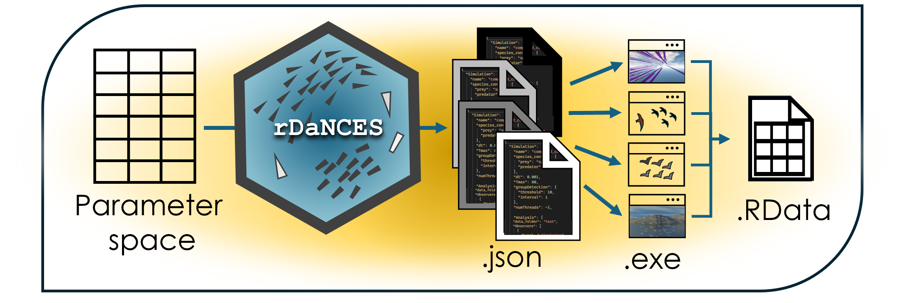

# *DaNCES_simulator*   

## Description 

This repository proposes a structure to facilitate the use of the [rDaNCES](https://github.com/marinapapa/rDaNCES) package to run agent-based simulations based on the [DaNCES framework](https://github.com/marinapapa/DaNCES_framework). Specifically, we recommend setting up:
1. A 'code' folder to include the scripts that run simulations and analyze the simulated data. See __get_started.R__ script for a step by step guide.

2. The rDaNCES folder (currently included as a submodule).

3. A 'simulation' folder that includes the model executables to be used. For a trial in Windows, the user can insert the compiled Release found in the DaNCES_framework repo. To keep track in the README of each full model, the user is advised to take advantage of version control of their model's GitHub repository, for instance:
- demo_model.exe: branch *develop* @583ebdf (tree: 732qsfda4n, commit am: 'exp 1 model')
- demo_model_v2.exe: branch *develop* @535edde (tree: 732qsfda4n, commit am: 'exp 2 model')

## Prerequisites
Apart from the R dependencies included in the package's documentation, to run the agent-based simulations one also needs to:
* Define enviornmental variable *dancesPATH* with the path to the full *dances* repo
* See prerequesites of C++ model [DaNCES](https://github.com/marinapapa/DaNCES_framework)

## Publication

Further information on the functionality of the framework see our accompanying publication: 

_Papadopoulou M, Hildenbrandt H, Hemelrijk CK. (2025) A data-inspired framework to simulate collective behaviour of predator-prey systems._

### Acknowledgements
The development of this software was mainly supported by an NWO grant awarded to Prof. Dr. Charlotte K. Hemelrijk at the University of Groningen.

## Authors
* **Marina Papadopoulou** - For any problem email at: <m.papadopoulou.rug@gmail.com>
